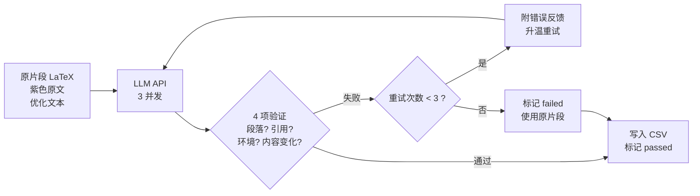

# AIGC 检测报告处理

对 AIGC 检测系统（维普/知网等）导出的 HTML 统计报告进行自动分析：提取疑似 AIGC 片段、在 LaTeX 源文件中插入定位标记、将降重后的文本还原到 LaTeX。

## 三步走

```bash
# 1. 创建 job 并放入文件
python3 aigcpass.py init --jobid mypaper
#    → 把 main.tex 和 HTML 报告放到 jobs/mypaper/ 下

# 2. Stage 1：提取标记（在 Claude Code 中说，或在终端运行）
python3 aigcpass.py stage1 --jobid mypaper
#    → 解析 HTML 紫色标记 → 在 main.tex 中插入 % AIGC_BEGIN_{N} / % AIGC_END_{N}
#    → 输出 input_fragments.txt（送降重）

# 3. 降重后，Stage 2：还原到 LaTeX
#    先把降重结果保存为 report/AIGC片段优化.txt，然后：
python3 aigcpass.py stage2 --jobid mypaper
#    → LLM API 逐段适配（实时面板）→ 验证 → 失败自动重试
#    → 审阅：python3 aigcpass.py diff --csv ... -t 原片段 修改后片段
#    → 应用：python3 aigcpass.py apply --jobid mypaper
```

---

## 设计思路

### 问题

AIGC 检测报告把疑似 AI 生成的文本用紫色标记出来，但标记的是 HTML 渲染后的纯文本。论文源文件是 LaTeX，里面有 `\cite`、`\ref`、`\texttt`、公式、表格等大量 LaTeX 命令。手工逐段对比 HTML 报告和 LaTeX 源码、定位每一处紫色文本、再手工替换措辞，非常耗时且容易出错。

### 解决方案

分两个阶段：

**Stage 1 — 定位与标记**

脚本解析 HTML 报告，找出所有紫色文本。然后去 LaTeX 源码中定位（先去掉 LaTeX 命令做纯文本匹配，找到后向外扩展到段落边界），在每段紫色文本的起止位置插入 `% AIGC_BEGIN_{N}` 和 `% AIGC_END_{N}` 注释标记。这样每个 AIGC 片段的位置就被永久记录在 LaTeX 源码中了——后续无论是人工修改还是自动适配，都只需要看标记之间的内容。

同时输出两个纯文本文件：`input_fragments.txt`（仅紫色文本）和 `input_paragraphs.txt`（完整段落上下文），供用户送降重工具处理。

**Stage 2 — 还原**

用户把降重后的文本保存为 `AIGC片段优化.txt`。这个文件是纯文本——降重工具不认识 LaTeX。Stage 2 的任务是把纯文本的措辞变化"映射"回 LaTeX 源码：保留所有 LaTeX 命令和结构不变，只替换中文/英文措辞。

这个映射过程用 LLM API 完成。每段单独调用 API（3 并发），返回后立即验证：
- 段落数（含空行）是否和原文一致
- `\cite`/`\ref` 引用 key 是否完整保留
- LaTeX 环境（`\begin`/`\end`）是否配对
- 内容是否真的变化了（防止 API 回显原文）

验证失败就附带错误反馈重试，最多 3 次。通过后立即写入 CSV——如果中途中断，已完成的片段不会丢失。

### 为什么用 API 而不是 Agent 手动适配

早期版本让 Agent（Claude）逐段手工适配——Agent 阅读原文 LaTeX 和优化文本，自行写出适配后的 LaTeX。实践中遇到两个核心问题：

1. Agent 容易把优化文本"粘贴"到原文后面（而不是替换），导致段落数膨胀
2. 缺乏可重复性——同样的输入在不同会话中可能产生不同的输出

改用 API 调用后，验证是机械化、可复现的，不合规就自动重试。遗留问题：DeepSeek 模型有"保守回显"倾向——部分片段即使重试 4 次也仍然返回原文。换成 `deepseek-v4-pro` 配合 `temperature=0.3` 效果最好（~77% 一次通过率）。

---

## 使用详解

### 目录结构

每个 job 是一个独立的工作目录：

```
jobs/{jobid}/
  main.tex                      # LaTeX 源文件
  report/
    *.html                       # AIGC 检测报告
    AIGC片段优化.txt              # 降重后的文本（Stage 1 后、Stage 2 前放入）
  result/
    stage1/
      main.tex.bak               # 原始 LaTeX 备份
      疑似AIGC片段.csv            # 3 列：标记ID、AIGC片段、AIGC段落
      input_fragments.txt        # 送降重：仅紫色文本
      input_paragraphs.txt       # 送降重：完整段落上下文
    stage2/
      main.tex.bak               # 标记版备份（带污染保护）
      疑似AIGC片段_待确认.csv     # 5 列：+ 原片段 + 修改后片段
```

### 统一入口

所有功能通过 `aigcpass.py` 调用，无需进入 `script/` 目录：

| 命令 | 用途 |
|------|------|
| `python3 aigcpass.py init --jobid ID` | 创建新 job 目录结构 |
| `python3 aigcpass.py stage1 --jobid ID` | 执行 Stage 1 |
| `python3 aigcpass.py stage2 --jobid ID` | 执行 Stage 2（实时面板） |
| `python3 aigcpass.py diff --csv CSV -t COL1 COL2` | icdiff 分屏对比 |
| `python3 aigcpass.py xvalidate --jobid ID` | 交叉验证 |
| `python3 aigcpass.py apply --jobid ID` | 应用 CSV 到 main.tex |
| `python3 aigcpass.py diagnose` | 诊断段落数匹配 |

---

### Stage 1 详解

**前置条件**：
- `jobs/{jobid}/main.tex` 存在且非空
- `jobs/{jobid}/report/` 下有至少一个 `.html` 文件

**执行**：
```bash
python3 aigcpass.py stage1 --jobid mypaper
```

等价于 `python3 script/extract_aigc.py --jobid mypaper`。

**流程**：

1. 解析 HTML 报告，识别紫色标记（通过 `<a class="cl3">` CSS 类或内联 `color: #5E30CC` 样式）。合并相邻的紫色片段（无可见文字分隔的归为同一段落）。

2. 在 `main.tex` 中定位紫色文本。对每个片段：去掉 LaTeX 命令后做纯文本子串匹配，找到位置后向外扩展到最近的段落边界（空行）。如果紫色文本跨越多段（中间夹有浮体），则包含所有中间段落。

3. 从文件末尾向前逆序插入 `% AIGC_BEGIN_{N}` 和 `% AIGC_END_{N}` 标记，每个标记独占一行。逆序处理保证前面标记的位置不受后面插入的影响。

4. 提取标记之间的完整 LaTeX 源码，清洗为纯文本：
   - 浮动环境（图/表）→ `<类型: label_key>`，使用 `\label{key}` 而非 `\caption{text}`
   - `\ref{type:key}` → 根据 HTML 渲染文本反查为可读数字
   - `\cite{key}` → `[key]`
   - 公式 → `<公式>`
   - 其他 LaTeX 命令 → 删除，保留文本内容

5. 输出 CSV（标记ID、AIGC片段、AIGC段落）和两个 input 文件（双空行分隔，每段一行）。

6. 备份原始 `main.tex` → `result/stage1/main.tex.bak`。

**产物**：

| 文件 | 列/格式 | 说明 |
|------|---------|------|
| `疑似AIGC片段.csv` | 标记ID, AIGC片段, AIGC段落 | 片段=仅紫色文本, 段落=完整上下文 |
| `input_fragments.txt` | 双空行分隔 | 送降重：仅紫色文本 |
| `input_paragraphs.txt` | 双空行分隔 | 送降重：完整段落 |
| `main.tex.bak` | — | 原始备份 |

**两种降重路径**：

| 路径 | 送降重文件 | 降重后保存为 | 特点 |
|------|-----------|-------------|------|
| 片段（推荐） | `input_fragments.txt` | `AIGC片段优化.txt` | 只改紫色文本，前后缀不动 |
| 段落 | `input_paragraphs.txt` | `AIGC段落优化.txt` | 改完整段落上下文 |

**手动修复遗漏片段**：

若脚本输出 `[MISS] fragment N`，说明自动匹配失败。需要手动在 `main.tex` 中确认该片段的位置（起始行:列 → 结束行:列），添加到 `script/extract_aigc.py` 的 `MANUAL_POSITIONS` 字典中，然后恢复 `main.tex` 重新运行：

```bash
cp jobs/{jobid}/result/stage1/main.tex.bak jobs/{jobid}/main.tex
python3 aigcpass.py stage1 --jobid {jobid}
```

---

### Stage 2 详解

**前置条件**：
- `main.tex` 包含 `% AIGC_BEGIN_` 标记（Stage 1 完成后）
- `result/stage1/疑似AIGC片段.csv` 存在
- `report/AIGC片段优化.txt`（或 `AIGC段落优化.txt`）存在
- `result/stage2/main.tex.bak` 不存在，或与当前 `main.tex` 内容一致（污染保护）

**执行**：
```bash
python3 aigcpass.py stage2 --jobid mypaper --concurrency 3
```

等价于 `python3 -u script/stage2_api.py --jobid mypaper --concurrency 3`，但 `aigcpass.py stage2` 会通过 `os.execv` 接管控台以显示实时面板。

**流程**：



1. **备份**：将带标记的 `main.tex` 备份到 `result/stage2/main.tex.bak`。如果备份已存在但内容与当前 `main.tex` 不同，终止并报错（防止覆盖干净备份）。

2. **逐段适配**：对每个非 `<不用改>` 片段，用 `prompt/stage2_fitback.md` 作为提示词模板，填入原片段 LaTeX、原始紫色文本、优化后文本，调用 LLM API。

3. **即时验证**：每个响应返回后立即验证：
   - **段落单位数**：空行也算一个单位，原文 3 段 + 2 空行 = 5 单位，适配后也必须 5 单位
   - **LaTeX 环境配对**：`\begin`/`\end` 是否齐全
   - **引用完整性**：`\cite{...}` 和 `\ref{...}` 的 key 是否与原文一致
   - **内容变化**：适配后文本与原始紫色文本的差异是否 >= 5%（防止 API 回显原文）

4. **失败重试**：验证失败时，将错误信息附到重试提示词中，并提高温度以增加措辞多样性。最多重试 3 次。

5. **断点续传**：每完成一个片段立即写入 CSV。如果脚本中断，再次运行时会自动跳过已通过的片段，只处理未完成的部分。

6. **输出**：`疑似AIGC片段_待确认.csv`，在 Stage 1 CSV 基础上增加"原片段"和"修改后片段"两列。

**实时面板**：

运行时显示 `rich` 面板，每 0.3 秒刷新：

```
 Stage 2 fitback process : [████████████░░] 16/23 | 并发:3 | 通过:14 | ...
╭──────────┬──────────────┬──────────┬─────────────┬─────────────┬─────────╮
│ 片段     │ 状态         │ 尝试     │ 纯文本diff  │ 适配diff    │ 说明    │
│          │              │          │ rate        │ rate        │         │
├──────────┼──────────────┼──────────┼─────────────┼─────────────┼─────────┤
│ 1        │ ✓            │ 1/3      │  21%        │  44%        │ 通过    │
│ 5        │ ↩            │ 2/3      │  21%        │   -         │ 缺失..  │
│ 8        │ 🏃           │ 1/3      │   -         │   -         │ 调用    │
╰──────────┴──────────────┴──────────┴─────────────┴─────────────┴─────────╯
```

**面板字段含义**：

| 字段 | 含义 |
|------|------|
| 片段 | 标记 ID |
| 状态 | ⏳ 待处理 / 🏃 调用中 / ↩ 重试中 / ✓ 通过 / ✗ 失败（使用原片段） / ── 跳过（`<不用改>`） |
| 尝试 | 当前尝试 / 最大重试次数 |
| 纯文本 diff rate | 用户降重幅度：原始紫色文本与优化文本的字符级差异率（0-100%）。21% 表示约 1/5 的字符被改写 |
| 适配 diff rate | API 适配幅度：原始紫色文本与 API 输出（去除 LaTeX 后）的字符级差异率。应与纯文本 diff 在同一量级——差异过大说明 API 改了不该改的部分，差异过小（<5%）说明 API 没有真正修改文本 |
| 说明 | 最近一次验证错误或当前状态 |

**状态流转**：
```
pending → running → passed    （一次通过）
pending → running → retrying → running → passed   （重试后通过）
pending → running → retrying (×3) → failed        （全部失败，使用原片段）
```

**审阅与修改**：
```bash
# 逐段 icdiff 对比
python3 aigcpass.py diff --csv jobs/{jobid}/result/stage2/疑似AIGC片段_待确认.csv -t 原片段 修改后片段

# 批量交叉验证
python3 aigcpass.py xvalidate --jobid {jobid}
```

用户可以直接编辑 CSV 中"修改后片段"列来修正不满意的行。

**应用**：
```bash
python3 aigcpass.py apply --jobid {jobid}
```

该命令读取 CSV 的"修改后片段"列，替换 `main.tex` 中对应标记之间的内容。

**重新处理特定片段**：
```bash
python3 aigcpass.py stage2 --jobid {jobid} --start 8 --end 12
```
已通过的片段会被自动跳过。

---

### 配置文件

`config/api.yaml`：

```yaml
api:
  provider: "openai"                    # API 协议：openai 或 anthropic
  model: "deepseek-v4-pro"             # 模型
  temperature: 0.3                      # 温度 (0-1)。越高措辞越多样，太高导致不稳定
  max_tokens: 8192

  openai:
    base_url: "https://api.deepseek.com/v1/chat/completions"
    api_key: "sk-xxx"

  anthropic:                            # 备用（DeepSeek Anthropic 兼容端点）
    base_url: "https://api.deepseek.com/anthropic/v1/messages"
    api_key: "sk-xxx"

retry:
  max_retries: 3                        # 每段最多重试次数
  temperature_delta: 0.1               # 每次重试升温增量

validation:
  check_paragraph_count: true           # 段落数（含空行）
  check_latex_braces: true             # \begin/\end 配对
  check_cite_preserved: true           # \cite key 完整性
  check_ref_preserved: true            # \ref key 完整性
  check_content_changed: true          # 内容是否变化
```

**常用调优**：

| 问题 | 调整 |
|------|------|
| 很多片段 0% 适配 diff | 提高 `temperature`（如 0.5），增大 `temperature_delta` |
| 段落数频繁不匹配 | 保留 `check_paragraph_count: true`，API 在重试时会修正 |
| API 调用排队太久 | 提高 `--concurrency`（DeepSeek 有并发限制，建议 3-5） |
| 个别片段始终失败 | `--start N --end N` 单独重试，或手动编辑 CSV |

### 提示词模板

`prompt/stage2_fitback.md` 包含 LaTeX 结构保留规则（段落结构、引用命令、格式化命令、数学模式、浮动环境、列表环境、特殊字符转义、节命令、注释、非紫色前后缀等 10 类）。用户可根据论文特点修改该模板。模板使用三个占位符：

| 占位符 | 替换为 |
|--------|--------|
| `{original_fragment}` | 标记之间的完整 LaTeX 源码 |
| `{purple_text}` | 原始紫色文本（来自 `input_fragments.txt`） |
| `{optimized_text}` | 降重后的优化文本（来自 `AIGC片段优化.txt`） |

### 其他脚本

| 脚本 | 用途 |
|------|------|
| `script/extract_aigc.py` | Stage 1 核心逻辑 |
| `script/stage2_api.py` | Stage 2 核心逻辑（API 调用 + 并发 + 面板 + 验证） |
| `script/apply_stage2.py` | 将确认后的 CSV 写入 `main.tex` |
| `script/xvalidate.py` | 交叉验证：对比用户降重幅度与 API 适配幅度 |
| `script/diagnose_fragments.py` | 诊断 CSV 段落数是否匹配（空行也算） |
| `script/make_input.py` | 从 CSV 重生成 input 文件 |

### 恢复

```bash
# 恢复到 Stage 1 之前（原始文件）
cp jobs/{jobid}/result/stage1/main.tex.bak jobs/{jobid}/main.tex

# 恢复到 Stage 2 之前（标记版，未适配）
cp jobs/{jobid}/result/stage2/main.tex.bak jobs/{jobid}/main.tex
```

注意：Stage 2 脚本在备份前会检查已有备份是否与当前 `main.tex` 一致。如果不一致（被污染的 Stage 2 输出覆盖了标记版备份），脚本会终止并提示恢复。这是防止不可逆错误的安全机制——一旦标记版备份被覆盖，就无法恢复到干净的 Stage 1 状态。
