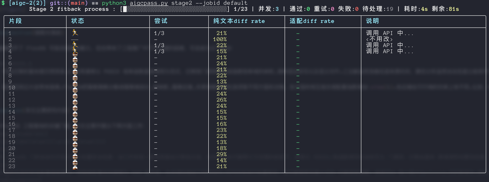

# aigcpass

AIGC 检测报告处理 — Claude Code Skill。自动提取 HTML 报告中的疑似 AIGC 片段、在 LaTeX 源文件中插入定位标记、通过 LLM API 将降重后的文本还原。

> [!WARNING]
> - 宇宙级免责声明：最终效果完全取决于你最开始的论文好坏以及你使用的降重软件，本项目只是帮助你节省一些手动的时间和多余资金，当然你也完全可以当老资历去手搓。
> - 目前仅支持Mac/Linux平台，Windows我没试过
> - 你所有需要降重的内容都需要被包含在main.tex，如果你有分小节的书写LaTeX习惯，恭喜你你用不了（doge
> - 希望能帮到大家，祝你们都能顺利过检！Let's goooooo~

## 🔥 Overview

1. stage2运行截图：


2. Stage2 整体流程：

<!-- 居中 -->
<div align="center">
  
</div>

## 安装

将整个目录放入 `.claude/skills/aigcpass/`（你也可以放在其他位置）：

```bash
git clone https://github.com/HugoPhi/aigcpass.git ~/.claude/skills/aigcpass/
```

确保已安装依赖：

```bash
pip3 install --break-system-packages rich pyyaml
brew install icdiff   # 用于逐段 diff 审阅
```

## 使用

在 Claude Code 中说：

```
对 job mypaper 执行 aigcpass
```

Agent 会自动引导你完成全流程：

1. Agent 询问并配置 API key（无需手动运行向导）
2. 执行 Stage 1 提取标记 → **审查片段完整性**（防跨段落渗入）
3. 等待你送降重
4. 降重文本返回后 → **审查不规范用语**（如"十分"、括号补充等）
5. 执行 Stage 2 将降重文本适配回 LaTeX
6. **审查适配质量**（交集覆盖率标准）
7. 确认后应用

**只有需要你操作时 Agent 才会停下来：** 放文件、编辑 API key、送降重、运行实时面板命令、确认审查报告。

## 需要你手动运行的命令

以下命令 Agent 不会替你执行（它们需要终端交互）。默认安装路径为 `~/.claude/skills/aigcpass/`，如果安装在其他位置请先 `cd` 到对应目录：

```bash
# Stage 2 API 适配（Step 3，显示实时面板）
cd ~/.claude/skills/aigcpass && python3 -u script/stage2_api.py --jobid mypaper --concurrency 3

# 逐段审阅
cd ~/.claude/skills/aigcpass && python3 aigcpass.py diff --csv jobs/mypaper/result/stage2/疑似AIGC片段_待确认.csv -t 原片段 修改后片段
```

## 你的 job 目录结构

Agent 会引导你创建 `jobs/{jobid}/`，结构如下：

```
jobs/{jobid}/
  api.yaml                      # LLM API 配置（每 job 独立，支持多厂商）
  main.tex                      # LaTeX 源文件
  report/
    *.html                       # AIGC 检测报告
    AIGC片段优化.txt              # 降重后放入
  result/
    stage1/                      # Stage 1 产物
    stage2/                      # Stage 2 产物
```

## 配置

每 job 独立配置 `jobs/{jobid}/api.yaml`。Agent 会询问你选择服务商、模型并填写 API key，自动生成配置。你也可以手动编辑该文件。

### 支持的服务商

| 服务商 | 协议 | 推荐模型 |
|--------|------|---------|
| DeepSeek | OpenAI-compatible | `deepseek-v4-pro` |
| Kimi (月之暗面) | OpenAI-compatible | `kimi-k2.6` |
| Qwen (阿里云) | OpenAI-compatible | `qwen-plus` |
| GLM (智谱AI) | OpenAI-compatible | `glm-5.1` |
| OpenAI | Native OpenAI | `gpt-4.1` |
| Claude (Anthropic) | Native Anthropic | `claude-opus-4-7` |
| Gemini (Google) | Native Gemini | `gemini-2.5-pro` |

以及任何兼容 OpenAI Chat Completions 格式的自定义平台。

### 配置文件格式

```yaml
api:
  provider: "deepseek"
  type: "openai"
  base_url: "https://api.deepseek.com/v1/chat/completions"
  api_key: "sk-xxx"
  model: "deepseek-v4-pro"
  temperature: 0.3
  max_tokens: 8192

retry:
  max_retries: 3
  temperature_delta: 0.1

validation:
  check_paragraph_count: true
  check_latex_braces: true
  check_cite_preserved: true
  check_ref_preserved: true
  check_content_changed: true
```


## 自定义审查规则

如果你需要增加自己的降重文本审查规则（例如禁止特定词汇、检查句式结构等），编辑 `~/.claude/skills/aigcpass/doc/check_optimization.md`（或对应安装路径下的 `doc/check_optimization.md`）。

该文件包含 6 类默认检查项，每项的格式为：

```markdown
### N. 检查项名称

**模式**：描述匹配规则

**示例**：
| 不规范 | 建议修改 |
|--------|---------|
| xxx | yyy |

**检查方法**：`grep` 命令
```

按相同格式添加新的检查项即可。Agent 在 Stage 2 之前会自动读取该文件并执行所有检查。同时更新 SKILL.md 中 Step 2.5 的检查清单列表。


## 目录结构

```
├── SKILL.md                     # Agent 主流程
├── README.md                    # 本文件
├── aigcpass.py                  # 可选：CLI 统一入口
├── doc/
│   ├── scripts.md               # 脚本参考
│   ├── check_fragments.md       # 片段完整性审查
│   ├── check_optimization.md    # 降重文本不规范用语审查
│   ├── check_stage2_csv.md      # 适配质量审查
│   └── configure.md             # 配置指导
├── prompt/
│   └── stage2_fitback.md        # LLM 提示词模板
├── template/
│   └── api.yaml.example         # API 配置模板
├── script/
│   ├── extract_aigc.py          # Stage 1
│   ├── stage2_api.py            # Stage 2
│   ├── apply_stage2.py          # 应用
│   ├── xvalidate.py             # 交叉验证
│   ├── diagnose_fragments.py    # 段落诊断
│   ├── make_input.py            # 重建 input
│   └── fix_*.py                 # 修复工具
└── assets/
    └── screen_shot.png          # 面板截图
```

## 纯手动使用（可选）

如果你不想用 Agent，可以通过 `aigcpass.py` 统一入口完成所有操作。请先 `cd` 到 skill 安装目录（默认 `~/.claude/skills/aigcpass/`）：

```bash
cd ~/.claude/skills/aigcpass

# 创建 job 目录
python3 aigcpass.py init --jobid mypaper

# 放入 main.tex 和 HTML 报告

# 配置 API（Agent 模式下会自动询问生成；纯手动时请复制模板编辑）
# cp template/api.yaml.example jobs/mypaper/api.yaml
# 编辑 api.yaml 填入 provider、type、base_url、api_key、model 等参数

# Stage 1
python3 aigcpass.py stage1 --jobid mypaper

# 送降重（手动）→ 结果保存为 jobs/mypaper/report/AIGC片段优化.txt

# Stage 2
python3 aigcpass.py stage2 --jobid mypaper

# 审阅
python3 aigcpass.py diff --csv jobs/mypaper/result/stage2/疑似AIGC片段_待确认.csv -t 原片段 修改后片段

# 交叉验证
python3 aigcpass.py xvalidate --jobid mypaper

# 应用
python3 aigcpass.py apply --jobid mypaper
```

全部可用命令见 `cd ~/.claude/skills/aigcpass && python3 aigcpass.py --help`，详细参数说明见 `doc/scripts.md`。
